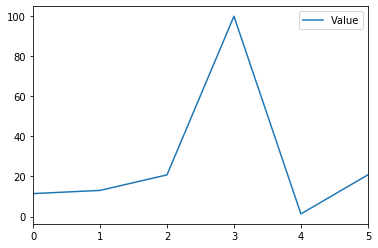

### Probando Hoja de trucos de Pandas 
##### Campo de aplicacion 

NumPy es una biblioteca extendida de lenguaje Python. Admite una gran cantidad de matrices dimensionales avanzadas y operaciones de matriz, y también proporciona una gran cantidad de bibliotecas de funciones matemáticas para operaciones de matriz.

 Pandas es una herramienta basada en NumPy, que fue creada para resolver tareas de análisis de datos. Pandas incorpora una gran cantidad de bibliotecas y algunos modelos de datos estándar, proporcionando las herramientas necesarias para manipular de manera eficiente grandes conjuntos de datos. Pandas proporciona una gran cantidad de funciones y métodos que nos permiten procesar datos de forma rápida y sencilla
##### Utilizando las hojas de trucos de Pandas, complete cada uno de los ejercicios de pruebas.

[Hoja de trucos de Pandas #1](https://uraccan1-my.sharepoint.com/personal/yesser_miranda_5fxt_d_uraccan_edu_ni/_layouts/15/onedrive.aspx?id=%2Fpersonal%2Fyesser%5Fmiranda%5F5fxt%5Fd%5Furaccan%5Fedu%5Fni%2FDocuments%2FDOCENCIA%2F2021%2FS2%2FFUNDAMENTOS%5FINTELIGENCIA%5FARTIFICIAL%2FLIBROS%2FPandas%5FCheatSheet%5F1%2Epdf&parent=%2Fpersonal%2Fyesser%5Fmiranda%5F5fxt%5Fd%5Furaccan%5Fedu%5Fni%2FDocuments%2FDOCENCIA%2F2021%2FS2%2FFUNDAMENTOS%5FINTELIGENCIA%5FARTIFICIAL%2FLIBROS&originalPath=aHR0cHM6Ly91cmFjY2FuMS1teS5zaGFyZXBvaW50LmNvbS86YjovZy9wZXJzb25hbC95ZXNzZXJfbWlyYW5kYV81Znh0X2RfdXJhY2Nhbl9lZHVfbmkvRWVsVDlZZlFmdFpHcUQyR2ozNHFSQm9CaDZFNXNSSnlaZkJtU1lHc3pmc2N2UT9ydGltZT1kdlVwUklOcTJVZw)

[Hoja de trucos de Pandas #2](https://uraccan1-my.sharepoint.com/personal/yesser_miranda_5fxt_d_uraccan_edu_ni/_layouts/15/onedrive.aspx?id=%2Fpersonal%2Fyesser%5Fmiranda%5F5fxt%5Fd%5Furaccan%5Fedu%5Fni%2FDocuments%2FDOCENCIA%2F2021%2FS2%2FFUNDAMENTOS%5FINTELIGENCIA%5FARTIFICIAL%2FLIBROS%2FPandas%5FCheatSheet%5F2%2Epdf&parent=%2Fpersonal%2Fyesser%5Fmiranda%5F5fxt%5Fd%5Furaccan%5Fedu%5Fni%2FDocuments%2FDOCENCIA%2F2021%2FS2%2FFUNDAMENTOS%5FINTELIGENCIA%5FARTIFICIAL%2FLIBROS&originalPath=aHR0cHM6Ly91cmFjY2FuMS1teS5zaGFyZXBvaW50LmNvbS86YjovZy9wZXJzb25hbC95ZXNzZXJfbWlyYW5kYV81Znh0X2RfdXJhY2Nhbl9lZHVfbmkvRVZzU2NPUzhpZzFQdXJ2Wmp6YWQ4RzRCYU55eUJueDRKNXNLc0VPMTh0Zk1CQT9ydGltZT04WFhmUW9OcTJVZw)


#### PANDAS HOJA DE TRUCOS # 1
#### Pandas data structures


```python
import pandas as pd
import numpy as np
#Series — One dimensional labeled array
s = pd.Series([3, -5, 7, 4], index=['a', 'b', 'c', 'd'])
print(s)
```

    a    3
    b   -5
    c    7
    d    4
    dtype: int64
    


```python
#Data Frame — A two dimensional labeled data structure
data = {'Country': ['Belgium', 'India', 'Brazil'],
 'Capital': ['Brussels', 'New Delhi', 'Brasília'],
 'Population': [11190846, 1303171035, 207847528]}

df = pd.DataFrame(data,
 columns=['Country', 'Capital', 'Population'])
print(df)
```

       Country    Capital  Population
    0  Belgium   Brussels    11190846
    1    India  New Delhi  1303171035
    2   Brazil   Brasília   207847528
    


```python
path='datos_rrss.xlsx'
```

##### Read and Write to CSV


```python
#Read CSV file
#pd.read_csv('file.csv', header=None, nrows=5)
#Write to CSV file
#df.to_csv('myDataFrame.csv')
pd.read_csv('datos_rrss_t1.csv')
```


<div>
<style scoped>
    .dataframe tbody tr th:only-of-type {
        vertical-align: middle;
    }

    .dataframe tbody tr th {
        vertical-align: top;
    }

    .dataframe thead th {
        text-align: right;
    }
</style>
<table border="1" class="dataframe">
  <thead>
    <tr style="text-align: right;">
      <th></th>
      <th>Nombre</th>
      <th>Cantidad</th>
      <th>ES_FBK</th>
      <th>Anio</th>
    </tr>
  </thead>
  <tbody>
    <tr>
      <td>0</td>
      <td>Facebook</td>
      <td>2449</td>
      <td>VERDADERO</td>
      <td>2006</td>
    </tr>
    <tr>
      <td>1</td>
      <td>Twitter</td>
      <td>339</td>
      <td>FALSO</td>
      <td>2006</td>
    </tr>
    <tr>
      <td>2</td>
      <td>Instagram</td>
      <td>1000</td>
      <td>VERDADERO</td>
      <td>2010</td>
    </tr>
    <tr>
      <td>3</td>
      <td>YouTube</td>
      <td>2000</td>
      <td>FALSO</td>
      <td>2005</td>
    </tr>
    <tr>
      <td>4</td>
      <td>LinkedIn</td>
      <td>663</td>
      <td>FALSO</td>
      <td>2003</td>
    </tr>
    <tr>
      <td>5</td>
      <td>WhatsApp</td>
      <td>1600</td>
      <td>VERDADERO</td>
      <td>2009</td>
    </tr>
  </tbody>
</table>
</div>


##### Read and Write to Excel


```python
#Read Excel file
#pd.read_excel('file.xlsx')
#Write to Excel file
#pd.to_excel('dir/myDataFrame.xlsx', sheet_name='Sheet1')
### Read multiple sheets from the same file
 #xlsx = pd.ExcelFile('file.xls')
#df = pd.read_excel(xlsx, 'Sheet1')
pd.read_excel('datos_rrss.xlsx')
```


<div>
<style scoped>
    .dataframe tbody tr th:only-of-type {
        vertical-align: middle;
    }

    .dataframe tbody tr th {
        vertical-align: top;
    }

    .dataframe thead th {
        text-align: right;
    }
</style>
<table border="1" class="dataframe">
  <thead>
    <tr style="text-align: right;">
      <th></th>
      <th>Nombre</th>
      <th>Cantidad</th>
      <th>ES_FBK</th>
      <th>Año</th>
    </tr>
  </thead>
  <tbody>
    <tr>
      <td>0</td>
      <td>Facebook</td>
      <td>2449</td>
      <td>True</td>
      <td>2006</td>
    </tr>
    <tr>
      <td>1</td>
      <td>Twitter</td>
      <td>339</td>
      <td>False</td>
      <td>2006</td>
    </tr>
    <tr>
      <td>2</td>
      <td>Instagram</td>
      <td>1000</td>
      <td>True</td>
      <td>2010</td>
    </tr>
    <tr>
      <td>3</td>
      <td>YouTube</td>
      <td>2000</td>
      <td>False</td>
      <td>2005</td>
    </tr>
    <tr>
      <td>4</td>
      <td>LinkedIn</td>
      <td>663</td>
      <td>False</td>
      <td>2003</td>
    </tr>
    <tr>
      <td>5</td>
      <td>WhatsApp</td>
      <td>1600</td>
      <td>True</td>
      <td>2009</td>
    </tr>
  </tbody>
</table>
</div>


##### Asking for Help


```python
help(pd.Series.loc)
```

    Help on property:
    
        Access a group of rows and columns by label(s) or a boolean array.
        
        ``.loc[]`` is primarily label based, but may also be used with a
        boolean array.
        
        Allowed inputs are:
        
        - A single label, e.g. ``5`` or ``'a'``, (note that ``5`` is
          interpreted as a *label* of the index, and **never** as an
          integer position along the index).
        - A list or array of labels, e.g. ``['a', 'b', 'c']``.
        - A slice object with labels, e.g. ``'a':'f'``.
        
          .. warning:: Note that contrary to usual python slices, **both** the
              start and the stop are included
        
        - A boolean array of the same length as the axis being sliced,
          e.g. ``[True, False, True]``.
        - A ``callable`` function with one argument (the calling Series or
          DataFrame) and that returns valid output for indexing (one of the above)
        
        See more at :ref:`Selection by Label <indexing.label>`
        
        Raises
        ------
        KeyError:
            when any items are not found
        
        See Also
        --------
        DataFrame.at : Access a single value for a row/column label pair.
        DataFrame.iloc : Access group of rows and columns by integer position(s).
        DataFrame.xs : Returns a cross-section (row(s) or column(s)) from the
            Series/DataFrame.
        Series.loc : Access group of values using labels.
        
        Examples
        --------
        **Getting values**
        
        >>> df = pd.DataFrame([[1, 2], [4, 5], [7, 8]],
        ...      index=['cobra', 'viper', 'sidewinder'],
        ...      columns=['max_speed', 'shield'])
        >>> df
                    max_speed  shield
        cobra               1       2
        viper               4       5
        sidewinder          7       8
        
        Single label. Note this returns the row as a Series.
        
        >>> df.loc['viper']
        max_speed    4
        shield       5
        Name: viper, dtype: int64
        
        List of labels. Note using ``[[]]`` returns a DataFrame.
        
        >>> df.loc[['viper', 'sidewinder']]
                    max_speed  shield
        viper               4       5
        sidewinder          7       8
        
        Single label for row and column
        
        >>> df.loc['cobra', 'shield']
        2
        
        Slice with labels for row and single label for column. As mentioned
        above, note that both the start and stop of the slice are included.
        
        >>> df.loc['cobra':'viper', 'max_speed']
        cobra    1
        viper    4
        Name: max_speed, dtype: int64
        
        Boolean list with the same length as the row axis
        
        >>> df.loc[[False, False, True]]
                    max_speed  shield
        sidewinder          7       8
        
        Conditional that returns a boolean Series
        
        >>> df.loc[df['shield'] > 6]
                    max_speed  shield
        sidewinder          7       8
        
        Conditional that returns a boolean Series with column labels specified
        
        >>> df.loc[df['shield'] > 6, ['max_speed']]
                    max_speed
        sidewinder          7
        
        Callable that returns a boolean Series
        
        >>> df.loc[lambda df: df['shield'] == 8]
                    max_speed  shield
        sidewinder          7       8
        
        **Setting values**
        
        Set value for all items matching the list of labels
        
        >>> df.loc[['viper', 'sidewinder'], ['shield']] = 50
        >>> df
                    max_speed  shield
        cobra               1       2
        viper               4      50
        sidewinder          7      50
        
        Set value for an entire row
        
        >>> df.loc['cobra'] = 10
        >>> df
                    max_speed  shield
        cobra              10      10
        viper               4      50
        sidewinder          7      50
        
        Set value for an entire column
        
        >>> df.loc[:, 'max_speed'] = 30
        >>> df
                    max_speed  shield
        cobra              30      10
        viper              30      50
        sidewinder         30      50
        
        Set value for rows matching callable condition
        
        >>> df.loc[df['shield'] > 35] = 0
        >>> df
                    max_speed  shield
        cobra              30      10
        viper               0       0
        sidewinder          0       0
        
        **Getting values on a DataFrame with an index that has integer labels**
        
        Another example using integers for the index
        
        >>> df = pd.DataFrame([[1, 2], [4, 5], [7, 8]],
        ...      index=[7, 8, 9], columns=['max_speed', 'shield'])
        >>> df
           max_speed  shield
        7          1       2
        8          4       5
        9          7       8
        
        Slice with integer labels for rows. As mentioned above, note that both
        the start and stop of the slice are included.
        
        >>> df.loc[7:9]
           max_speed  shield
        7          1       2
        8          4       5
        9          7       8
        
        **Getting values with a MultiIndex**
        
        A number of examples using a DataFrame with a MultiIndex
        
        >>> tuples = [
        ...    ('cobra', 'mark i'), ('cobra', 'mark ii'),
        ...    ('sidewinder', 'mark i'), ('sidewinder', 'mark ii'),
        ...    ('viper', 'mark ii'), ('viper', 'mark iii')
        ... ]
        >>> index = pd.MultiIndex.from_tuples(tuples)
        >>> values = [[12, 2], [0, 4], [10, 20],
        ...         [1, 4], [7, 1], [16, 36]]
        >>> df = pd.DataFrame(values, columns=['max_speed', 'shield'], index=index)
        >>> df
                             max_speed  shield
        cobra      mark i           12       2
                   mark ii           0       4
        sidewinder mark i           10      20
                   mark ii           1       4
        viper      mark ii           7       1
                   mark iii         16      36
        
        Single label. Note this returns a DataFrame with a single index.
        
        >>> df.loc['cobra']
                 max_speed  shield
        mark i          12       2
        mark ii          0       4
        
        Single index tuple. Note this returns a Series.
        
        >>> df.loc[('cobra', 'mark ii')]
        max_speed    0
        shield       4
        Name: (cobra, mark ii), dtype: int64
        
        Single label for row and column. Similar to passing in a tuple, this
        returns a Series.
        
        >>> df.loc['cobra', 'mark i']
        max_speed    12
        shield        2
        Name: (cobra, mark i), dtype: int64
        
        Single tuple. Note using ``[[]]`` returns a DataFrame.
        
        >>> df.loc[[('cobra', 'mark ii')]]
                       max_speed  shield
        cobra mark ii          0       4
        
        Single tuple for the index with a single label for the column
        
        >>> df.loc[('cobra', 'mark i'), 'shield']
        2
        
        Slice from index tuple to single label
        
        >>> df.loc[('cobra', 'mark i'):'viper']
                             max_speed  shield
        cobra      mark i           12       2
                   mark ii           0       4
        sidewinder mark i           10      20
                   mark ii           1       4
        viper      mark ii           7       1
                   mark iii         16      36
        
        Slice from index tuple to index tuple
        
        >>> df.loc[('cobra', 'mark i'):('viper', 'mark ii')]
                            max_speed  shield
        cobra      mark i          12       2
                   mark ii          0       4
        sidewinder mark i          10      20
                   mark ii          1       4
        viper      mark ii          7       1
    
    

##### Selection 
##### Getting


```python

#Get one element
s['b']

```


    -5


```python
#Get subset of a DataFrame
df[1:]
```


<div>
<style scoped>
    .dataframe tbody tr th:only-of-type {
        vertical-align: middle;
    }

    .dataframe tbody tr th {
        vertical-align: top;
    }

    .dataframe thead th {
        text-align: right;
    }
</style>
<table border="1" class="dataframe">
  <thead>
    <tr style="text-align: right;">
      <th></th>
      <th>Country</th>
      <th>Capital</th>
      <th>Population</th>
    </tr>
  </thead>
  <tbody>
    <tr>
      <td>1</td>
      <td>India</td>
      <td>New Delhi</td>
      <td>1303171035</td>
    </tr>
    <tr>
      <td>2</td>
      <td>Brazil</td>
      <td>Brasília</td>
      <td>207847528</td>
    </tr>
  </tbody>
</table>
</div>


### Selecting, Boolean Indexing & Setting


###### By Position


```python
#Select single value by row & Column
df.iloc[0,0]
df.iat([0],[0])
```


    'Belgium'


##### By label


```python
#Select single value by row and column labels
df.loc[0,'Country']
df.at([0], ['Country']) 
```


    'Belgium'


##### By Label/Position 


```python
#Select single row of subset rows
df.ix[2]
```

    C:\Users\POXS44\Anaconda3\lib\site-packages\ipykernel_launcher.py:2: FutureWarning: 
    .ix is deprecated. Please use
    .loc for label based indexing or
    .iloc for positional indexing
    
    See the documentation here:
    http://pandas.pydata.org/pandas-docs/stable/user_guide/indexing.html#ix-indexer-is-deprecated
      
    


    Country          Brazil
    Capital        Brasília
    Population    207847528
    Name: 2, dtype: object


```python
#Select a single column of subset of columns
df.ix[:,'Capital']
```

    C:\Users\POXS44\Anaconda3\lib\site-packages\ipykernel_launcher.py:2: FutureWarning: 
    .ix is deprecated. Please use
    .loc for label based indexing or
    .iloc for positional indexing
    
    See the documentation here:
    http://pandas.pydata.org/pandas-docs/stable/user_guide/indexing.html#ix-indexer-is-deprecated
      
    


    0     Brussels
    1    New Delhi
    2     Brasília
    Name: Capital, dtype: object


```python
#Select rows and columns
df.ix[1,'Capital']
```

    C:\Users\POXS44\Anaconda3\lib\site-packages\ipykernel_launcher.py:2: FutureWarning: 
    .ix is deprecated. Please use
    .loc for label based indexing or
    .iloc for positional indexing
    
    See the documentation here:
    http://pandas.pydata.org/pandas-docs/stable/user_guide/indexing.html#ix-indexer-is-deprecated
      
    


    'New Delhi'


##### Boolean Indexing


```python
#Series s where value is not >1
s[~(s > 1)] 
```


    b   -5
    dtype: int64


```python
#s where value is <-1 or >2
s[(s < -1) | (s > 2)] 
```


    a    3
    b   -5
    c    7
    d    4
    dtype: int64


```python
#Use filter to adjust DataFrame
 df[df['Population']>1200000000]

```

##### Setting


```python
# Set index a of Series s to 6
s['a'] = 6 
print(s)
```

    a    6
    b   -5
    c    7
    d    4
    dtype: int64
    

### Read and Write to SQL Query or Database Table


```python
# Read SqL Query
from sqlalchemy import create_engine
engine = create_engine('sqlite:///:memory:')
pd.read_sql("SELECT * FROM my_table;", engine)
pd.read_sql_table('my_table', engine)
pd.read_sql_query("SELECT * FROM my_table;", engine)
#Write to Sql Query
 pd.to_sql('myDF', engine)
```

### Droppping 


```python
#values 
print(s)
```

    a    6
    b   -5
    c    7
    d    4
    dtype: int64
    


```python
#Drop values from rows (axis=0)
s.drop(['a', 'c'])
```


    b   -5
    d    4
    dtype: int64


```python
#Drop values from columns(axis=1)
df.drop('Country', axis=1)
```


<div>
<style scoped>
    .dataframe tbody tr th:only-of-type {
        vertical-align: middle;
    }

    .dataframe tbody tr th {
        vertical-align: top;
    }

    .dataframe thead th {
        text-align: right;
    }
</style>
<table border="1" class="dataframe">
  <thead>
    <tr style="text-align: right;">
      <th></th>
      <th>Capital</th>
      <th>Population</th>
    </tr>
  </thead>
  <tbody>
    <tr>
      <td>0</td>
      <td>Brussels</td>
      <td>11190846</td>
    </tr>
    <tr>
      <td>1</td>
      <td>New Delhi</td>
      <td>1303171035</td>
    </tr>
    <tr>
      <td>2</td>
      <td>Brasília</td>
      <td>207847528</td>
    </tr>
  </tbody>
</table>
</div>


### Sort & Rank


```python
#Values df
print(df)
```

       Country    Capital  Population
    0  Belgium   Brussels    11190846
    1    India  New Delhi  1303171035
    2   Brazil   Brasília   207847528
    


```python
#Sort by labels along an axis
df.sort_index()
```


<div>
<style scoped>
    .dataframe tbody tr th:only-of-type {
        vertical-align: middle;
    }

    .dataframe tbody tr th {
        vertical-align: top;
    }

    .dataframe thead th {
        text-align: right;
    }
</style>
<table border="1" class="dataframe">
  <thead>
    <tr style="text-align: right;">
      <th></th>
      <th>Country</th>
      <th>Capital</th>
      <th>Population</th>
    </tr>
  </thead>
  <tbody>
    <tr>
      <td>0</td>
      <td>Belgium</td>
      <td>Brussels</td>
      <td>11190846</td>
    </tr>
    <tr>
      <td>1</td>
      <td>India</td>
      <td>New Delhi</td>
      <td>1303171035</td>
    </tr>
    <tr>
      <td>2</td>
      <td>Brazil</td>
      <td>Brasília</td>
      <td>207847528</td>
    </tr>
  </tbody>
</table>
</div>


```python
#Sort by the values along an axis
df.sort_values(by='Country')
```


<div>
<style scoped>
    .dataframe tbody tr th:only-of-type {
        vertical-align: middle;
    }

    .dataframe tbody tr th {
        vertical-align: top;
    }

    .dataframe thead th {
        text-align: right;
    }
</style>
<table border="1" class="dataframe">
  <thead>
    <tr style="text-align: right;">
      <th></th>
      <th>Country</th>
      <th>Capital</th>
      <th>Population</th>
    </tr>
  </thead>
  <tbody>
    <tr>
      <td>0</td>
      <td>Belgium</td>
      <td>Brussels</td>
      <td>11190846</td>
    </tr>
    <tr>
      <td>2</td>
      <td>Brazil</td>
      <td>Brasília</td>
      <td>207847528</td>
    </tr>
    <tr>
      <td>1</td>
      <td>India</td>
      <td>New Delhi</td>
      <td>1303171035</td>
    </tr>
  </tbody>
</table>
</div>


```python
#Assign ranks to entries
df.rank() 
```


<div>
<style scoped>
    .dataframe tbody tr th:only-of-type {
        vertical-align: middle;
    }

    .dataframe tbody tr th {
        vertical-align: top;
    }

    .dataframe thead th {
        text-align: right;
    }
</style>
<table border="1" class="dataframe">
  <thead>
    <tr style="text-align: right;">
      <th></th>
      <th>Country</th>
      <th>Capital</th>
      <th>Population</th>
    </tr>
  </thead>
  <tbody>
    <tr>
      <td>0</td>
      <td>1.0</td>
      <td>2.0</td>
      <td>1.0</td>
    </tr>
    <tr>
      <td>1</td>
      <td>3.0</td>
      <td>3.0</td>
      <td>3.0</td>
    </tr>
    <tr>
      <td>2</td>
      <td>2.0</td>
      <td>1.0</td>
      <td>2.0</td>
    </tr>
  </tbody>
</table>
</div>


### Retrieving Series/DataFrame Information

##### Basic Information 


```python
#Values df
print(df)
```

       Country    Capital  Population
    0  Belgium   Brussels    11190846
    1    India  New Delhi  1303171035
    2   Brazil   Brasília   207847528
    


```python
#(rows,columns) 
df.shape
```


    (3, 3)


```python
#Describe index
df.index
```


    RangeIndex(start=0, stop=3, step=1)


```python
#Describe DataFrame columns
df.columns
```


    Index(['Country', 'Capital', 'Population'], dtype='object')


```python
#Info on DataFrame
df.info()
```

    <class 'pandas.core.frame.DataFrame'>
    RangeIndex: 3 entries, 0 to 2
    Data columns (total 3 columns):
    Country       3 non-null object
    Capital       3 non-null object
    Population    3 non-null int64
    dtypes: int64(1), object(2)
    memory usage: 200.0+ bytes
    


```python
#Number of non-NA values
df.count()
```


    Country       3
    Capital       3
    Population    3
    dtype: int64


### Summary


```python
#Sum of values
df.sum()
```


```python
#Cummulative sum of values
df.cumsum()
```


```python
#Minimum
df.min()
#max values
df.max()
```


```python
#Minimum/Maximum index value
df.idxmin()
df.idxmax()
```


```python
#Summary statistics
df.describe()
```


<div>
<style scoped>
    .dataframe tbody tr th:only-of-type {
        vertical-align: middle;
    }

    .dataframe tbody tr th {
        vertical-align: top;
    }

    .dataframe thead th {
        text-align: right;
    }
</style>
<table border="1" class="dataframe">
  <thead>
    <tr style="text-align: right;">
      <th></th>
      <th>Population</th>
    </tr>
  </thead>
  <tbody>
    <tr>
      <td>count</td>
      <td>3.000000e+00</td>
    </tr>
    <tr>
      <td>mean</td>
      <td>5.074031e+08</td>
    </tr>
    <tr>
      <td>std</td>
      <td>6.961346e+08</td>
    </tr>
    <tr>
      <td>min</td>
      <td>1.119085e+07</td>
    </tr>
    <tr>
      <td>25%</td>
      <td>1.095192e+08</td>
    </tr>
    <tr>
      <td>50%</td>
      <td>2.078475e+08</td>
    </tr>
    <tr>
      <td>75%</td>
      <td>7.555093e+08</td>
    </tr>
    <tr>
      <td>max</td>
      <td>1.303171e+09</td>
    </tr>
  </tbody>
</table>
</div>


```python
#Mean of values
df.mean()
```


    Population    5.074031e+08
    dtype: float64


```python
#Median of values
df.median()
```


    Population    207847528.0
    dtype: float64


### Applying Functions


```python
#Apply function
df.apply(lambda x: x*2)
```


<div>
<style scoped>
    .dataframe tbody tr th:only-of-type {
        vertical-align: middle;
    }

    .dataframe tbody tr th {
        vertical-align: top;
    }

    .dataframe thead th {
        text-align: right;
    }
</style>
<table border="1" class="dataframe">
  <thead>
    <tr style="text-align: right;">
      <th></th>
      <th>Country</th>
      <th>Capital</th>
      <th>Population</th>
    </tr>
  </thead>
  <tbody>
    <tr>
      <td>0</td>
      <td>BelgiumBelgium</td>
      <td>BrusselsBrussels</td>
      <td>22381692</td>
    </tr>
    <tr>
      <td>1</td>
      <td>IndiaIndia</td>
      <td>New DelhiNew Delhi</td>
      <td>2606342070</td>
    </tr>
    <tr>
      <td>2</td>
      <td>BrazilBrazil</td>
      <td>BrasíliaBrasília</td>
      <td>415695056</td>
    </tr>
  </tbody>
</table>
</div>


### Data Alignment


```python
s3 = pd.Series([7, -2, 3], index=['a', 'c', 'd'])
s + s3
```


    a    13.0
    b     NaN
    c     5.0
    d     7.0
    dtype: float64


```python
s.sub(s3, fill_value=2)
```


    a   -1.0
    b   -7.0
    c    9.0
    d    1.0
    dtype: float64


```python
 s.div(s3, fill_value=4)

```


    a    0.857143
    b   -1.250000
    c   -3.500000
    d    1.333333
    dtype: float64


```python
s.mul(s3, fill_value=3)
```


    a    42.0
    b   -15.0
    c   -14.0
    d    12.0
    dtype: float64


## Hoja de trucos pandas 2


### Reshaping Data

##### Pivot 


```python
import pandas as pd

###Declaracion de df
df = pd.DataFrame({'species': ['bear', 'bear', 'marsupial'],
                  'population': [1864, 22000, 80000]},
                  index=['panda', 'polar', 'koala'])

#Data Frame — A two dimensional labeled data structure
data = {'Date': ['2016-03-01','2016-03-02','2016-03-01','2016-03-03','2016-03-02','2016-03-03'],
        'Type': ['a','b','c','a','a','c'],
        'Value': [11.432,13.031,20.784,99.906,1.303,20.784]}

df2 = pd.DataFrame(data,
 columns=['Date', 'Type', 'Value'])

print(df2)
#Spread rows into columns 

```

             Date Type   Value
    0  2016-03-01    a  11.432
    1  2016-03-02    b  13.031
    2  2016-03-01    c  20.784
    3  2016-03-03    a  99.906
    4  2016-03-02    a   1.303
    5  2016-03-03    c  20.784
    


```python
#Spread rows into columns
df3= df2.pivot(index='Date',
              columns='Type',
              values='Value')
print(df3)
```

    Type             a       b       c
    Date                              
    2016-03-01  11.432     NaN  20.784
    2016-03-02   1.303  13.031     NaN
    2016-03-03  99.906     NaN  20.784
    

##### Pivot Table


```python
df4= pd.pivot_table(df2,
                   values='Value',
                   index='Date',
                   columns='Type')
print(df4)
```

    Type             a       b       c
    Date                              
    2016-03-01  11.432     NaN  20.784
    2016-03-02   1.303  13.031     NaN
    2016-03-03  99.906     NaN  20.784
    


```python
# Pivot a level of column labels

```


```python
#Gather columns into rows
pd.melt(df2,
        id_vars=["Date"],
        value_vars=["Type","Value"],
        value_name="Observations")


```


<div>
<style scoped>
    .dataframe tbody tr th:only-of-type {
        vertical-align: middle;
    }

    .dataframe tbody tr th {
        vertical-align: top;
    }

    .dataframe thead th {
        text-align: right;
    }
</style>
<table border="1" class="dataframe">
  <thead>
    <tr style="text-align: right;">
      <th></th>
      <th>Date</th>
      <th>variable</th>
      <th>Observations</th>
    </tr>
  </thead>
  <tbody>
    <tr>
      <td>0</td>
      <td>2016-03-01</td>
      <td>Type</td>
      <td>a</td>
    </tr>
    <tr>
      <td>1</td>
      <td>2016-03-02</td>
      <td>Type</td>
      <td>b</td>
    </tr>
    <tr>
      <td>2</td>
      <td>2016-03-01</td>
      <td>Type</td>
      <td>c</td>
    </tr>
    <tr>
      <td>3</td>
      <td>2016-03-03</td>
      <td>Type</td>
      <td>a</td>
    </tr>
    <tr>
      <td>4</td>
      <td>2016-03-02</td>
      <td>Type</td>
      <td>a</td>
    </tr>
    <tr>
      <td>5</td>
      <td>2016-03-03</td>
      <td>Type</td>
      <td>c</td>
    </tr>
    <tr>
      <td>6</td>
      <td>2016-03-01</td>
      <td>Value</td>
      <td>11.432</td>
    </tr>
    <tr>
      <td>7</td>
      <td>2016-03-02</td>
      <td>Value</td>
      <td>13.031</td>
    </tr>
    <tr>
      <td>8</td>
      <td>2016-03-01</td>
      <td>Value</td>
      <td>20.784</td>
    </tr>
    <tr>
      <td>9</td>
      <td>2016-03-03</td>
      <td>Value</td>
      <td>99.906</td>
    </tr>
    <tr>
      <td>10</td>
      <td>2016-03-02</td>
      <td>Value</td>
      <td>1.303</td>
    </tr>
    <tr>
      <td>11</td>
      <td>2016-03-03</td>
      <td>Value</td>
      <td>20.784</td>
    </tr>
  </tbody>
</table>
</div>


```python
##Column-index,series pairs
df.iteritems()
```


    <generator object DataFrame.items at 0x000001C47D34FA48>


```python
#Row-index,series pairs
df.iterrows()
```


    <generator object DataFrame.iterrows at 0x00000139FE55A3C8>


### Advanced Indexing 


##### Selecting


```python
#Select cols with any vals >1
df3.loc[:,(df3>1).any()]
```


<div>
<style scoped>
    .dataframe tbody tr th:only-of-type {
        vertical-align: middle;
    }

    .dataframe tbody tr th {
        vertical-align: top;
    }

    .dataframe thead th {
        text-align: right;
    }
</style>
<table border="1" class="dataframe">
  <thead>
    <tr style="text-align: right;">
      <th>Type</th>
      <th>a</th>
      <th>b</th>
      <th>c</th>
    </tr>
    <tr>
      <th>Date</th>
      <th></th>
      <th></th>
      <th></th>
    </tr>
  </thead>
  <tbody>
    <tr>
      <td>2016-03-01</td>
      <td>11.432</td>
      <td>NaN</td>
      <td>20.784</td>
    </tr>
    <tr>
      <td>2016-03-02</td>
      <td>1.303</td>
      <td>13.031</td>
      <td>NaN</td>
    </tr>
    <tr>
      <td>2016-03-03</td>
      <td>99.906</td>
      <td>NaN</td>
      <td>20.784</td>
    </tr>
  </tbody>
</table>
</div>


```python
#Select cols with vals>1
df3.loc[:,(df3>1).all()]
```


<div>
<style scoped>
    .dataframe tbody tr th:only-of-type {
        vertical-align: middle;
    }

    .dataframe tbody tr th {
        vertical-align: top;
    }

    .dataframe thead th {
        text-align: right;
    }
</style>
<table border="1" class="dataframe">
  <thead>
    <tr style="text-align: right;">
      <th>Type</th>
      <th>a</th>
    </tr>
    <tr>
      <th>Date</th>
      <th></th>
    </tr>
  </thead>
  <tbody>
    <tr>
      <td>2016-03-01</td>
      <td>11.432</td>
    </tr>
    <tr>
      <td>2016-03-02</td>
      <td>1.303</td>
    </tr>
    <tr>
      <td>2016-03-03</td>
      <td>99.906</td>
    </tr>
  </tbody>
</table>
</div>


```python
#Select cols with NaN
df3.loc[:,df3.isnull().any()]
```


<div>
<style scoped>
    .dataframe tbody tr th:only-of-type {
        vertical-align: middle;
    }

    .dataframe tbody tr th {
        vertical-align: top;
    }

    .dataframe thead th {
        text-align: right;
    }
</style>
<table border="1" class="dataframe">
  <thead>
    <tr style="text-align: right;">
      <th>Type</th>
      <th>b</th>
      <th>c</th>
    </tr>
    <tr>
      <th>Date</th>
      <th></th>
      <th></th>
    </tr>
  </thead>
  <tbody>
    <tr>
      <td>2016-03-01</td>
      <td>NaN</td>
      <td>20.784</td>
    </tr>
    <tr>
      <td>2016-03-02</td>
      <td>13.031</td>
      <td>NaN</td>
    </tr>
    <tr>
      <td>2016-03-03</td>
      <td>NaN</td>
      <td>20.784</td>
    </tr>
  </tbody>
</table>
</div>


```python
#Select cols without NAN
df3.loc[:,df3.notnull().all()]
```


<div>
<style scoped>
    .dataframe tbody tr th:only-of-type {
        vertical-align: middle;
    }

    .dataframe tbody tr th {
        vertical-align: top;
    }

    .dataframe thead th {
        text-align: right;
    }
</style>
<table border="1" class="dataframe">
  <thead>
    <tr style="text-align: right;">
      <th>Type</th>
      <th>a</th>
    </tr>
    <tr>
      <th>Date</th>
      <th></th>
    </tr>
  </thead>
  <tbody>
    <tr>
      <td>2016-03-01</td>
      <td>11.432</td>
    </tr>
    <tr>
      <td>2016-03-02</td>
      <td>1.303</td>
    </tr>
    <tr>
      <td>2016-03-03</td>
      <td>99.906</td>
    </tr>
  </tbody>
</table>
</div>


##### Indexing With isin 


```python
#Find same elements
df[(df.Country.isin(df2.Type))]
```


<div>
<style scoped>
    .dataframe tbody tr th:only-of-type {
        vertical-align: middle;
    }

    .dataframe tbody tr th {
        vertical-align: top;
    }

    .dataframe thead th {
        text-align: right;
    }
</style>
<table border="1" class="dataframe">
  <thead>
    <tr style="text-align: right;">
      <th></th>
      <th>Country</th>
      <th>Capital</th>
      <th>Population</th>
    </tr>
  </thead>
  <tbody>
  </tbody>
</table>
</div>


```python
#Filter on values
df3.filter(items=“a”,“b”])
```


      File "<ipython-input-55-9be4bcf5286e>", line 2
        df3.filter(items=“a”,“b”])
                           ^
    SyntaxError: invalid character in identifier
    


```python
#Select specific elements
df.select(lambda x: not x%5)
```


    ---------------------------------------------------------------------------

    AttributeError                            Traceback (most recent call last)

    <ipython-input-58-2850b3072103> in <module>
          1 #Select specific elements
    ----> 2 df.select(lambda x: not x%5)
    

    ~\Anaconda3\lib\site-packages\pandas\core\generic.py in __getattr__(self, name)
       5177             if self._info_axis._can_hold_identifiers_and_holds_name(name):
       5178                 return self[name]
    -> 5179             return object.__getattribute__(self, name)
       5180 
       5181     def __setattr__(self, name, value):
    

    AttributeError: 'DataFrame' object has no attribute 'select'


##### Where


```python
#Subset the data
s.where(s > 0)
```


    a    3.0
    b    NaN
    c    7.0
    d    4.0
    dtype: float64


##### Query 


```python
#Query DataFrame
df6.query('second > first')
```

### Setting/Resetting Index


```python
# Set the index
df.set_index('Country')
```


<div>
<style scoped>
    .dataframe tbody tr th:only-of-type {
        vertical-align: middle;
    }

    .dataframe tbody tr th {
        vertical-align: top;
    }

    .dataframe thead th {
        text-align: right;
    }
</style>
<table border="1" class="dataframe">
  <thead>
    <tr style="text-align: right;">
      <th></th>
      <th>Capital</th>
      <th>Population</th>
    </tr>
    <tr>
      <th>Country</th>
      <th></th>
      <th></th>
    </tr>
  </thead>
  <tbody>
    <tr>
      <td>Belgium</td>
      <td>Brussels</td>
      <td>11190846</td>
    </tr>
    <tr>
      <td>India</td>
      <td>New Delhi</td>
      <td>1303171035</td>
    </tr>
    <tr>
      <td>Brazil</td>
      <td>Brasília</td>
      <td>207847528</td>
    </tr>
  </tbody>
</table>
</div>


```python
#Reset the index
df4 = df.reset_index()
print(df4)
```

       index  Country    Capital  Population
    0      0  Belgium   Brussels    11190846
    1      1    India  New Delhi  1303171035
    2      2   Brazil   Brasília   207847528
    


```python
#Renamme DataFrame
df = df.rename(index=str,
               columns={"Country":"cntry",
                        "Capital":"cptl",
                        "Population":"ppltn"})
print(df)
```

         cntry       cptl       ppltn
    0  Belgium   Brussels    11190846
    1    India  New Delhi  1303171035
    2   Brazil   Brasília   207847528
    

### Reindexing


```python
s2 = s.reindex(['a','c','d','e','b'])
print(s2)
```

    a    3.0
    c    7.0
    d    4.0
    e    NaN
    b   -5.0
    dtype: float64
    


```python
#Forward Filling
df.reindex(range(4),
           method='Ffill')
```


<div>
<style scoped>
    .dataframe tbody tr th:only-of-type {
        vertical-align: middle;
    }

    .dataframe tbody tr th {
        vertical-align: top;
    }

    .dataframe thead th {
        text-align: right;
    }
</style>
<table border="1" class="dataframe">
  <thead>
    <tr style="text-align: right;">
      <th></th>
      <th>Country</th>
      <th>Capital</th>
      <th>Population</th>
    </tr>
  </thead>
  <tbody>
    <tr>
      <td>0</td>
      <td>Belgium</td>
      <td>Brussels</td>
      <td>11190846</td>
    </tr>
    <tr>
      <td>1</td>
      <td>India</td>
      <td>New Delhi</td>
      <td>1303171035</td>
    </tr>
    <tr>
      <td>2</td>
      <td>Brazil</td>
      <td>Brasília</td>
      <td>207847528</td>
    </tr>
    <tr>
      <td>3</td>
      <td>Brazil</td>
      <td>Brasília</td>
      <td>207847528</td>
    </tr>
  </tbody>
</table>
</div>


```python
#Backward Filling
s3 = s.reindex(range(5),
               method='bfill')
```


    ---------------------------------------------------------------------------

    TypeError                                 Traceback (most recent call last)

    <ipython-input-111-b3ad4e058210> in <module>
          1 #Backward Filling
          2 s3 = s.reindex(range(5),
    ----> 3                method='bfill')
    

    ~\Anaconda3\lib\site-packages\pandas\core\series.py in reindex(self, index, **kwargs)
       4216     @Appender(generic.NDFrame.reindex.__doc__)
       4217     def reindex(self, index=None, **kwargs):
    -> 4218         return super().reindex(index=index, **kwargs)
       4219 
       4220     def drop(
    

    ~\Anaconda3\lib\site-packages\pandas\core\generic.py in reindex(self, *args, **kwargs)
       4512         # perform the reindex on the axes
       4513         return self._reindex_axes(
    -> 4514             axes, level, limit, tolerance, method, fill_value, copy
       4515         ).__finalize__(self)
       4516 
    

    ~\Anaconda3\lib\site-packages\pandas\core\generic.py in _reindex_axes(self, axes, level, limit, tolerance, method, fill_value, copy)
       4525             ax = self._get_axis(a)
       4526             new_index, indexer = ax.reindex(
    -> 4527                 labels, level=level, limit=limit, tolerance=tolerance, method=method
       4528             )
       4529 
    

    ~\Anaconda3\lib\site-packages\pandas\core\indexes\base.py in reindex(self, target, method, level, limit, tolerance)
       3406                 if self.is_unique and not getattr(self, "is_overlapping", False):
       3407                     indexer = self.get_indexer(
    -> 3408                         target, method=method, limit=limit, tolerance=tolerance
       3409                     )
       3410                 else:
    

    ~\Anaconda3\lib\site-packages\pandas\core\indexes\base.py in get_indexer(self, target, method, limit, tolerance)
       2978             target = target.astype(object)
       2979             return this.get_indexer(
    -> 2980                 target, method=method, limit=limit, tolerance=tolerance
       2981             )
       2982 
    

    ~\Anaconda3\lib\site-packages\pandas\core\indexes\base.py in get_indexer(self, target, method, limit, tolerance)
       2987 
       2988         if method == "pad" or method == "backfill":
    -> 2989             indexer = self._get_fill_indexer(target, method, limit, tolerance)
       2990         elif method == "nearest":
       2991             indexer = self._get_nearest_indexer(target, limit, tolerance)
    

    ~\Anaconda3\lib\site-packages\pandas\core\indexes\base.py in _get_fill_indexer(self, target, method, limit, tolerance)
       3020                 else self._engine.get_backfill_indexer
       3021             )
    -> 3022             indexer = method(target._ndarray_values, limit)
       3023         else:
       3024             indexer = self._get_fill_indexer_searchsorted(target, method, limit)
    

    pandas\_libs\index.pyx in pandas._libs.index.IndexEngine.get_backfill_indexer()
    

    pandas\_libs\algos.pyx in pandas._libs.algos.backfill()
    

    TypeError: '>' not supported between instances of 'int' and 'str'


### Multilndexing


```python
arrays = [np.array([1,2,3]),
          np.array([5,4,3])]
df5= pd.DataFrame(np.random.rand(3, 2), index=arrays)
tuples = list(zip(*arrays))
index = pd.MultiIndex.from_tuples(tuples,
                                  names=['first', 'second'])
df6= pd.DataFrame(np.random.rand(3, 2), index=index)
df2.set_index(["Date", "Type"])
```


<div>
<style scoped>
    .dataframe tbody tr th:only-of-type {
        vertical-align: middle;
    }

    .dataframe tbody tr th {
        vertical-align: top;
    }

    .dataframe thead th {
        text-align: right;
    }
</style>
<table border="1" class="dataframe">
  <thead>
    <tr style="text-align: right;">
      <th></th>
      <th></th>
      <th>Value</th>
    </tr>
    <tr>
      <th>Date</th>
      <th>Type</th>
      <th></th>
    </tr>
  </thead>
  <tbody>
    <tr>
      <td>2016-03-01</td>
      <td>a</td>
      <td>11.432</td>
    </tr>
    <tr>
      <td>2016-03-02</td>
      <td>b</td>
      <td>13.031</td>
    </tr>
    <tr>
      <td>2016-03-01</td>
      <td>c</td>
      <td>20.784</td>
    </tr>
    <tr>
      <td>2016-03-03</td>
      <td>a</td>
      <td>99.906</td>
    </tr>
    <tr>
      <td>2016-03-02</td>
      <td>a</td>
      <td>1.303</td>
    </tr>
    <tr>
      <td>2016-03-03</td>
      <td>c</td>
      <td>20.784</td>
    </tr>
  </tbody>
</table>
</div>


### Duplicate Data


```python
#Return unique values
s3.unique()
print(s3)
```


    ---------------------------------------------------------------------------

    NameError                                 Traceback (most recent call last)

    <ipython-input-110-cf90a66268af> in <module>
          1 #Return unique values
    ----> 2 s3.unique()
          3 print(s3)
    

    NameError: name 's3' is not defined


```python
#Check duplicates 
df2.duplicated('Type')
```


    0    False
    1    False
    2    False
    3     True
    4     True
    5     True
    dtype: bool


```python
#Drop duplicates
df2.drop_duplicates('Type', keep='last')
```


<div>
<style scoped>
    .dataframe tbody tr th:only-of-type {
        vertical-align: middle;
    }

    .dataframe tbody tr th {
        vertical-align: top;
    }

    .dataframe thead th {
        text-align: right;
    }
</style>
<table border="1" class="dataframe">
  <thead>
    <tr style="text-align: right;">
      <th></th>
      <th>Date</th>
      <th>Type</th>
      <th>Value</th>
    </tr>
  </thead>
  <tbody>
    <tr>
      <td>1</td>
      <td>2016-03-02</td>
      <td>b</td>
      <td>13.031</td>
    </tr>
    <tr>
      <td>4</td>
      <td>2016-03-02</td>
      <td>a</td>
      <td>1.303</td>
    </tr>
    <tr>
      <td>5</td>
      <td>2016-03-03</td>
      <td>c</td>
      <td>20.784</td>
    </tr>
  </tbody>
</table>
</div>


```python
#Check index duplicates
df.index.duplicated()
```


    array([False, False, False])


### Grouping Data

##### Aggregation 


```python
df2.groupby(by=['Date','Type']).mean()
```


<div>
<style scoped>
    .dataframe tbody tr th:only-of-type {
        vertical-align: middle;
    }

    .dataframe tbody tr th {
        vertical-align: top;
    }

    .dataframe thead th {
        text-align: right;
    }
</style>
<table border="1" class="dataframe">
  <thead>
    <tr style="text-align: right;">
      <th></th>
      <th></th>
      <th>Value</th>
    </tr>
    <tr>
      <th>Date</th>
      <th>Type</th>
      <th></th>
    </tr>
  </thead>
  <tbody>
    <tr>
      <td rowspan="2" valign="top">2016-03-01</td>
      <td>a</td>
      <td>11.432</td>
    </tr>
    <tr>
      <td>c</td>
      <td>20.784</td>
    </tr>
    <tr>
      <td rowspan="2" valign="top">2016-03-02</td>
      <td>a</td>
      <td>1.303</td>
    </tr>
    <tr>
      <td>b</td>
      <td>13.031</td>
    </tr>
    <tr>
      <td rowspan="2" valign="top">2016-03-03</td>
      <td>a</td>
      <td>99.906</td>
    </tr>
    <tr>
      <td>c</td>
      <td>20.784</td>
    </tr>
  </tbody>
</table>
</div>


```python
df4.groupby(level=0).sum()
```


<div>
<style scoped>
    .dataframe tbody tr th:only-of-type {
        vertical-align: middle;
    }

    .dataframe tbody tr th {
        vertical-align: top;
    }

    .dataframe thead th {
        text-align: right;
    }
</style>
<table border="1" class="dataframe">
  <thead>
    <tr style="text-align: right;">
      <th></th>
      <th>index</th>
      <th>Population</th>
    </tr>
  </thead>
  <tbody>
    <tr>
      <td>0</td>
      <td>0</td>
      <td>11190846</td>
    </tr>
    <tr>
      <td>1</td>
      <td>1</td>
      <td>1303171035</td>
    </tr>
    <tr>
      <td>2</td>
      <td>2</td>
      <td>207847528</td>
    </tr>
  </tbody>
</table>
</div>


```python
df4.groupby(level=0).agg({'a':lambda x:sum(x)/len(x),
                          'b': np.sum})
```

##### Transformation 


```python
customSum = lambda x: (x+x%2)
df4.groupby(level=0).transform(customSum)
```


<div>
<style scoped>
    .dataframe tbody tr th:only-of-type {
        vertical-align: middle;
    }

    .dataframe tbody tr th {
        vertical-align: top;
    }

    .dataframe thead th {
        text-align: right;
    }
</style>
<table border="1" class="dataframe">
  <thead>
    <tr style="text-align: right;">
      <th></th>
      <th>index</th>
      <th>Population</th>
    </tr>
  </thead>
  <tbody>
    <tr>
      <td>0</td>
      <td>0</td>
      <td>11190846</td>
    </tr>
    <tr>
      <td>1</td>
      <td>2</td>
      <td>1303171036</td>
    </tr>
    <tr>
      <td>2</td>
      <td>2</td>
      <td>207847528</td>
    </tr>
  </tbody>
</table>
</div>


### Mising Data


```python
#Drop NaN values
df.dropna()
```


<div>
<style scoped>
    .dataframe tbody tr th:only-of-type {
        vertical-align: middle;
    }

    .dataframe tbody tr th {
        vertical-align: top;
    }

    .dataframe thead th {
        text-align: right;
    }
</style>
<table border="1" class="dataframe">
  <thead>
    <tr style="text-align: right;">
      <th></th>
      <th>Country</th>
      <th>Capital</th>
      <th>Population</th>
    </tr>
  </thead>
  <tbody>
    <tr>
      <td>0</td>
      <td>Belgium</td>
      <td>Brussels</td>
      <td>11190846</td>
    </tr>
    <tr>
      <td>1</td>
      <td>India</td>
      <td>New Delhi</td>
      <td>1303171035</td>
    </tr>
    <tr>
      <td>2</td>
      <td>Brazil</td>
      <td>Brasília</td>
      <td>207847528</td>
    </tr>
  </tbody>
</table>
</div>


```python
#Fill NaN values with a predetermined value
df3.fillna(df3.mean())
```


<div>
<style scoped>
    .dataframe tbody tr th:only-of-type {
        vertical-align: middle;
    }

    .dataframe tbody tr th {
        vertical-align: top;
    }

    .dataframe thead th {
        text-align: right;
    }
</style>
<table border="1" class="dataframe">
  <thead>
    <tr style="text-align: right;">
      <th>Type</th>
      <th>a</th>
      <th>b</th>
      <th>c</th>
    </tr>
    <tr>
      <th>Date</th>
      <th></th>
      <th></th>
      <th></th>
    </tr>
  </thead>
  <tbody>
    <tr>
      <td>2016-03-01</td>
      <td>11.432</td>
      <td>13.031</td>
      <td>20.784</td>
    </tr>
    <tr>
      <td>2016-03-02</td>
      <td>1.303</td>
      <td>13.031</td>
      <td>20.784</td>
    </tr>
    <tr>
      <td>2016-03-03</td>
      <td>99.906</td>
      <td>13.031</td>
      <td>20.784</td>
    </tr>
  </tbody>
</table>
</div>


```python
#Replace values with others
df2.replace("a","f")
```


<div>
<style scoped>
    .dataframe tbody tr th:only-of-type {
        vertical-align: middle;
    }

    .dataframe tbody tr th {
        vertical-align: top;
    }

    .dataframe thead th {
        text-align: right;
    }
</style>
<table border="1" class="dataframe">
  <thead>
    <tr style="text-align: right;">
      <th></th>
      <th>Date</th>
      <th>Type</th>
      <th>Value</th>
    </tr>
  </thead>
  <tbody>
    <tr>
      <td>0</td>
      <td>2000-01-31</td>
      <td>f</td>
      <td>11.432</td>
    </tr>
    <tr>
      <td>1</td>
      <td>2000-02-29</td>
      <td>b</td>
      <td>13.031</td>
    </tr>
    <tr>
      <td>2</td>
      <td>2000-03-31</td>
      <td>c</td>
      <td>20.784</td>
    </tr>
    <tr>
      <td>3</td>
      <td>2000-04-30</td>
      <td>f</td>
      <td>99.906</td>
    </tr>
    <tr>
      <td>4</td>
      <td>2000-05-31</td>
      <td>f</td>
      <td>1.303</td>
    </tr>
    <tr>
      <td>5</td>
      <td>2000-06-30</td>
      <td>c</td>
      <td>20.784</td>
    </tr>
  </tbody>
</table>
</div>


### Combining Data


```python

data1 = pd.DataFrame({'X1': ['a','b','c'], 'X2': [11.432,1.303, 99.906]}); data1
data2 = pd.DataFrame({'X1': ['a','b','d'], 'X3': [20.78,"NaN", 20.784]}); data2
print(data1)
print(data2)
```

      X1      X2
    0  a  11.432
    1  b   1.303
    2  c  99.906
      X1      X3
    0  a   20.78
    1  b     NaN
    2  d  20.784
    

### Merge


```python
pd.merge(data1,
         data2,
        how='left',
        on='X1')
```


<div>
<style scoped>
    .dataframe tbody tr th:only-of-type {
        vertical-align: middle;
    }

    .dataframe tbody tr th {
        vertical-align: top;
    }

    .dataframe thead th {
        text-align: right;
    }
</style>
<table border="1" class="dataframe">
  <thead>
    <tr style="text-align: right;">
      <th></th>
      <th>X1</th>
      <th>X2</th>
      <th>X3</th>
    </tr>
  </thead>
  <tbody>
    <tr>
      <td>0</td>
      <td>a</td>
      <td>11.432</td>
      <td>20.78</td>
    </tr>
    <tr>
      <td>1</td>
      <td>b</td>
      <td>1.303</td>
      <td>NaN</td>
    </tr>
    <tr>
      <td>2</td>
      <td>c</td>
      <td>99.906</td>
      <td>NaN</td>
    </tr>
  </tbody>
</table>
</div>


```python
pd.merge(data1,
         data2,
        how='right',
        on='X1')
```


<div>
<style scoped>
    .dataframe tbody tr th:only-of-type {
        vertical-align: middle;
    }

    .dataframe tbody tr th {
        vertical-align: top;
    }

    .dataframe thead th {
        text-align: right;
    }
</style>
<table border="1" class="dataframe">
  <thead>
    <tr style="text-align: right;">
      <th></th>
      <th>X1</th>
      <th>X2</th>
      <th>X3</th>
    </tr>
  </thead>
  <tbody>
    <tr>
      <td>0</td>
      <td>a</td>
      <td>11.432</td>
      <td>20.78</td>
    </tr>
    <tr>
      <td>1</td>
      <td>b</td>
      <td>1.303</td>
      <td>NaN</td>
    </tr>
    <tr>
      <td>2</td>
      <td>d</td>
      <td>NaN</td>
      <td>20.784</td>
    </tr>
  </tbody>
</table>
</div>


```python
pd.merge(data1,
         data2,
        how='inner',
        on='X1')
```


<div>
<style scoped>
    .dataframe tbody tr th:only-of-type {
        vertical-align: middle;
    }

    .dataframe tbody tr th {
        vertical-align: top;
    }

    .dataframe thead th {
        text-align: right;
    }
</style>
<table border="1" class="dataframe">
  <thead>
    <tr style="text-align: right;">
      <th></th>
      <th>X1</th>
      <th>X2</th>
      <th>X3</th>
    </tr>
  </thead>
  <tbody>
    <tr>
      <td>0</td>
      <td>a</td>
      <td>11.432</td>
      <td>20.78</td>
    </tr>
    <tr>
      <td>1</td>
      <td>b</td>
      <td>1.303</td>
      <td>NaN</td>
    </tr>
  </tbody>
</table>
</div>


```python
pd.merge(data1,
         data2,
        how='outer',
        on='X1')
```


<div>
<style scoped>
    .dataframe tbody tr th:only-of-type {
        vertical-align: middle;
    }

    .dataframe tbody tr th {
        vertical-align: top;
    }

    .dataframe thead th {
        text-align: right;
    }
</style>
<table border="1" class="dataframe">
  <thead>
    <tr style="text-align: right;">
      <th></th>
      <th>X1</th>
      <th>X2</th>
      <th>X3</th>
    </tr>
  </thead>
  <tbody>
    <tr>
      <td>0</td>
      <td>a</td>
      <td>11.432</td>
      <td>20.78</td>
    </tr>
    <tr>
      <td>1</td>
      <td>b</td>
      <td>1.303</td>
      <td>NaN</td>
    </tr>
    <tr>
      <td>2</td>
      <td>c</td>
      <td>99.906</td>
      <td>NaN</td>
    </tr>
    <tr>
      <td>3</td>
      <td>d</td>
      <td>NaN</td>
      <td>20.784</td>
    </tr>
  </tbody>
</table>
</div>


### Join 


```python
data1.join(data2, how='right')
```

### Concatenate


```python
#Vertical
s.append(s2)

```


    a    3.0
    b   -5.0
    c    7.0
    d    4.0
    a    3.0
    c    7.0
    d    4.0
    e    NaN
    b   -5.0
    dtype: float64


```python
#Horizontal/vertical
pd.concat([s,s2],axis=1, keys=['One','Two'])

```

    C:\Users\POXS44\Anaconda3\lib\site-packages\ipykernel_launcher.py:2: FutureWarning: Sorting because non-concatenation axis is not aligned. A future version
    of pandas will change to not sort by default.
    
    To accept the future behavior, pass 'sort=False'.
    
    To retain the current behavior and silence the warning, pass 'sort=True'.
    
      
    


<div>
<style scoped>
    .dataframe tbody tr th:only-of-type {
        vertical-align: middle;
    }

    .dataframe tbody tr th {
        vertical-align: top;
    }

    .dataframe thead th {
        text-align: right;
    }
</style>
<table border="1" class="dataframe">
  <thead>
    <tr style="text-align: right;">
      <th></th>
      <th>One</th>
      <th>Two</th>
    </tr>
  </thead>
  <tbody>
    <tr>
      <td>a</td>
      <td>3.0</td>
      <td>3.0</td>
    </tr>
    <tr>
      <td>b</td>
      <td>-5.0</td>
      <td>-5.0</td>
    </tr>
    <tr>
      <td>c</td>
      <td>7.0</td>
      <td>7.0</td>
    </tr>
    <tr>
      <td>d</td>
      <td>4.0</td>
      <td>4.0</td>
    </tr>
    <tr>
      <td>e</td>
      <td>NaN</td>
      <td>NaN</td>
    </tr>
  </tbody>
</table>
</div>


```python
pd.concat([data1, data2], axis=1, join='inner')
```


<div>
<style scoped>
    .dataframe tbody tr th:only-of-type {
        vertical-align: middle;
    }

    .dataframe tbody tr th {
        vertical-align: top;
    }

    .dataframe thead th {
        text-align: right;
    }
</style>
<table border="1" class="dataframe">
  <thead>
    <tr style="text-align: right;">
      <th></th>
      <th>X1</th>
      <th>X2</th>
      <th>X1</th>
      <th>X3</th>
    </tr>
  </thead>
  <tbody>
    <tr>
      <td>0</td>
      <td>a</td>
      <td>11.432</td>
      <td>a</td>
      <td>20.78</td>
    </tr>
    <tr>
      <td>1</td>
      <td>b</td>
      <td>1.303</td>
      <td>b</td>
      <td>NaN</td>
    </tr>
    <tr>
      <td>2</td>
      <td>c</td>
      <td>99.906</td>
      <td>d</td>
      <td>20.784</td>
    </tr>
  </tbody>
</table>
</div>


### Dates 


```python
df2['Date']= pd.to_datetime(df2['Date'])
df2['Date']= pd.date_range('2000-1-1',
                            periods=6,
                            freq='M')
dates = [datetime(2012,5,1), datetime(2012,5,2)]
index = pd.DatetimeIndex(dates)
index = pd.date_range(datetime(2012,2,1), end, freq='BM')
```

### Visualization


```python
import matplotlib.pyplot as plt
s.plot()
plt.show()
print(s)
```


    a    3
    b   -5
    c    7
    d    4
    dtype: int64
    


```python
df2.plot()
plt.show()
```





```python

```
